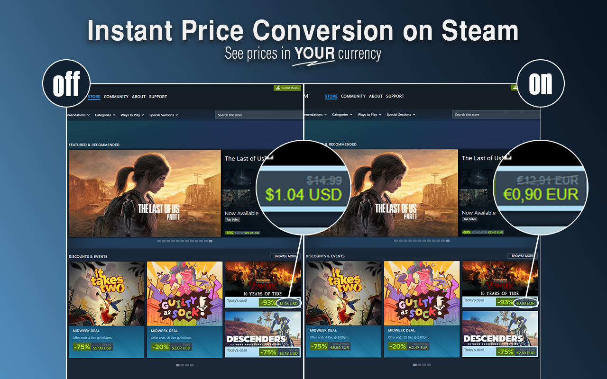
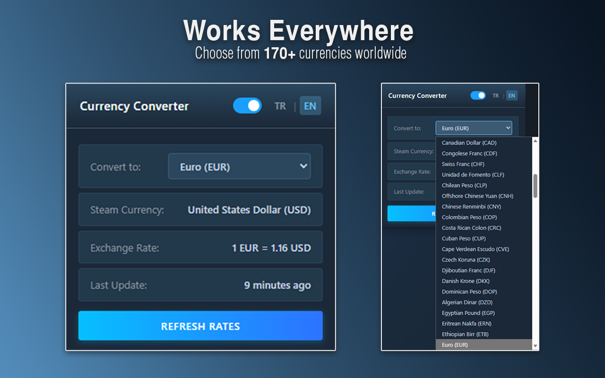
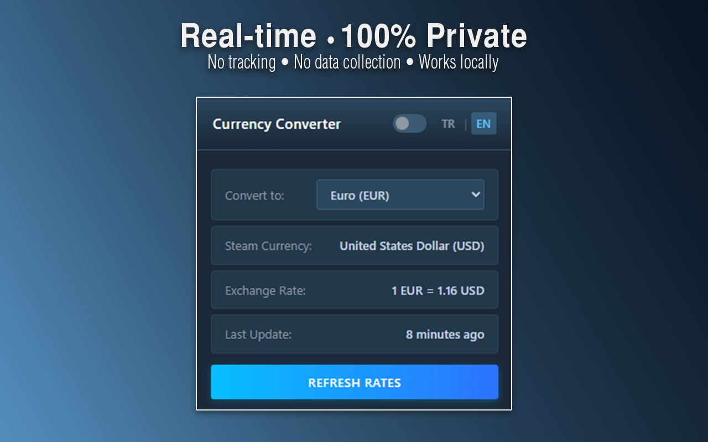

# Currency Converter for Steam

[](https://chromewebstore.google.com/detail/currency-converter-for-st/pmfjcaceniadnjkpjamcfonibolgfpmi)
[](https://github.com/cemozay/currency-converter-for-steam)

Ever browsing Steam and wondering what that game actually costs in your currency? This extension does exactly that—converts Steam prices to whatever currency you want. It's free, open-source, and doesn't need any API keys. Once it's set up, it works offline too.

## What it does

- Supports 170+ currencies from around the world
- Automatically figures out what currency Steam is showing you
- Converts prices in real-time as you browse
- Replaces prices directly on the page (no annoying badges or overlays)
- Available in English and Turkish
- Updates exchange rates daily
- Doesn't collect any of your data—everything happens on your computer

## Screenshots





## Installation

### Easy way (Chrome Web Store)

1. Go to the [Chrome Web Store page](https://chromewebstore.google.com/detail/currency-converter-for-st/pmfjcaceniadnjkpjamcfonibolgfpmi)
2. Click "Add to Chrome"
3. That's it! Head to any Steam page and you'll see prices in your currency

### For developers

If you want to tinker with it or contribute:

```bash
git clone https://github.com/cemozay/currency-converter-for-steam.git
cd currency-converter-for-steam
```

Then in Chrome:

1. Go to `chrome://extensions/`
2. Turn on "Developer mode" (top right corner)
3. Click "Load unpacked"
4. Select the folder you just cloned

## How it works

Pretty straightforward: you visit a Steam page, the extension detects what currency Steam is using, converts the prices to your chosen currency, and swaps them out. You see your currency instead of Steam's regional pricing.

### Supported currencies

Works with all 37 currencies that Steam supports:

**Major currencies:** USD, EUR, GBP, JPY, CNY  
**Americas:** BRL, CAD, MXN, CLP, COP, CRC, PEN, UYU  
**Europe:** TRY, RUB, PLN, UAH, CHF, SEK, NOK, DKK  
**Asia Pacific:** AUD, NZD, SGD, HKD, TWD, KRW, INR, IDR, MYR, PHP, THB, VND, KZT  
**Middle East:** AED, SAR, QAR, KWD, ILS  
**Africa:** ZAR

## Using it

**Pick your currency:** Click the extension icon and choose from the dropdown. Prices update right away.

**Check exchange rates:** The popup shows you the current rate between Steam's currency and yours (like "1 USD = 30.00 TRY").

**Update rates:** There's a refresh button if you want to manually update, but it does this automatically once a day anyway.

**Turn it on/off:** Use the toggle switch if you want to see original prices again.

## Contributing

Found a bug? Want to add a feature? Pull requests are welcome!

Standard GitHub workflow:

1. Fork it
2. Create a branch (`git checkout -b feature/cool-new-thing`)
3. Commit your changes (`git commit -m 'Added cool new thing'`)
4. Push (`git push origin feature/cool-new-thing`)
5. Open a pull request

Some ideas if you're looking to contribute:

- Translations for more languages
- Performance improvements
- Bug fixes (check the issues page)
- New features
- Better documentation

## License

MIT License—do whatever you want with it. See [LICENSE](LICENSE) for the legal stuff.

## Need help?

- Found a bug? [Open an issue](https://github.com/cemozay/currency-converter-for-steam/issues)
- Have questions? [Start a discussion](https://github.com/cemozay/currency-converter-for-steam/discussions)

## Privacy

Just to be clear:

- This extension doesn't collect any of your data
- It doesn't track what you do
- It doesn't send anything to third parties
- Everything runs locally on your computer
- The only thing it fetches is public exchange rate data

Exchange rates get cached on your machine and only update when needed.

---

Made for Steam users who are tired of doing mental math while browsing the store.
